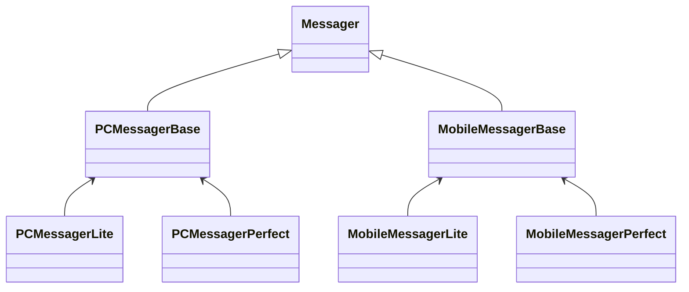
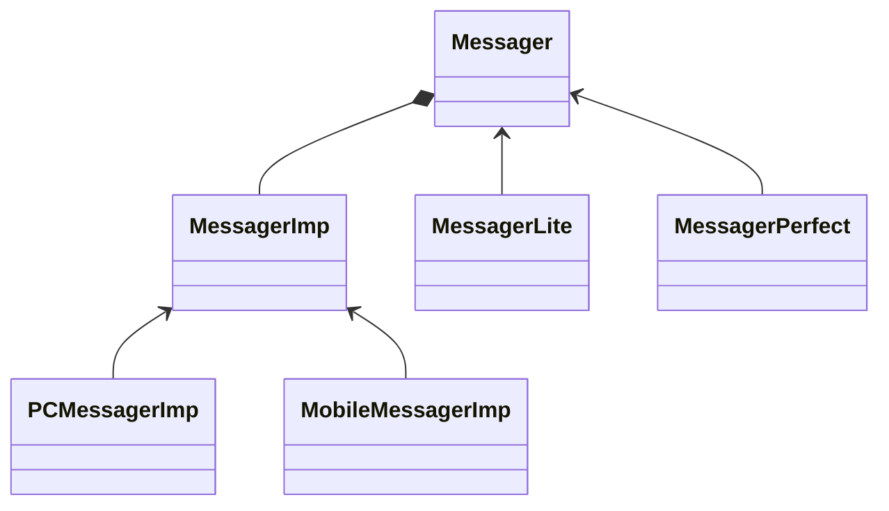

---
tags:
  - design/pattern
  - type/concept
mastery: 5
---
## 概述

将抽象部分 (业务功能) 与实现部分 (平台实现) 分离，使它们都可以独立地变化。 ——《设计模式》GoF

**动机**

- 由于某些类型的固有的实现逻辑，使得它们具有两个变化的维度，乃至多个纬度的变化。
- 如何应对这种 “多维度的变化”？如何利用面向对象技术来使得类型可以轻松地沿着两个乃至多个方向变化，而不引入额外的复杂度？

## 代码

### 初始代码

```cpp
// 通信的模块
class Messager {
public:
    virtual void Login(string username, string password) = 0;
    virtual void SendMessage(string message) = 0;
    virtual void SendPicture(Image image) = 0;

    virtual void PlaySound() = 0;
    virtual void DrawShape() = 0;
    virtual void WriteText() = 0;
    virtual void Connect() = 0;

    virtual ~Messager() {
    }
};

//平台实现

class PCMessagerBase : public Messager {
public:
    virtual void PlaySound() {
        //**********
    }
    virtual void DrawShape() {
        //**********
    }
    virtual void WriteText() {
        //**********
    }
    virtual void Connect() {
        //**********
    }
};

class MobileMessagerBase : public Messager {
public:
    virtual void PlaySound() {
        //==========
    }
    virtual void DrawShape() {
        //==========
    }
    virtual void WriteText() {
        //==========
    }
    virtual void Connect() {
        //==========
    }
};

//业务抽象

class PCMessagerLite : public PCMessagerBase {
public:
    virtual void Login(string username, string password) {
        PCMessagerBase::Connect();
        //........
    }
    virtual void SendMessage(string message) {
        PCMessagerBase::WriteText();
        //........
    }
    virtual void SendPicture(Image image) {
        PCMessagerBase::DrawShape();
        //........
    }
};

class PCMessagerPerfect : public PCMessagerBase {
public:
    virtual void Login(string username, string password) {
        PCMessagerBase::PlaySound();
        //********
        PCMessagerBase::Connect();
        //........
    }
    virtual void SendMessage(string message) {
        PCMessagerBase::PlaySound();
        //********
        PCMessagerBase::WriteText();
        //........
    }
    virtual void SendPicture(Image image) {
        PCMessagerBase::PlaySound();
        //********
        PCMessagerBase::DrawShape();
        //........
    }
};

class MobileMessagerLite : public MobileMessagerBase {
public:
    virtual void Login(string username, string password) {
        MobileMessagerBase::Connect();
        //........
    }
    virtual void SendMessage(string message) {
        MobileMessagerBase::WriteText();
        //........
    }
    virtual void SendPicture(Image image) {
        MobileMessagerBase::DrawShape();
        //........
    }
};

class MobileMessagerPerfect : public MobileMessagerBase {
public:
    virtual void Login(string username, string password) {
        MobileMessagerBase::PlaySound();
        //********
        MobileMessagerBase::Connect();
        //........
    }
    virtual void SendMessage(string message) {
        MobileMessagerBase::PlaySound();
        //********
        MobileMessagerBase::WriteText();
        //........
    }
    virtual void SendPicture(Image image) {
        MobileMessagerBase::PlaySound();
        //********
        MobileMessagerBase::DrawShape();
        //........
    }
};

// 类的数目
// 1 + n + n*m
void Process() {
    //编译时装配
    Messager *m = new MobileMessagerPerfect();
}

```



### 重构代码

改进：

1. 提取平台相关方法和业务相关方法作为两个类 `Messager`和`MessagerImp`
2. Messager 类作为业务逻辑方向的细分（不断继承）；MessagerImp 作为平台实现方向
3. Messager 类持有一个 MessagerImp 的基类指针，可以使用不通的具体平台类初始化这个基类指针
4. 

```cpp
class Messager {
protected:
    // 多态指针提升的位置
    MessagerImp* messagerImp;  //...

public:
    Messager(MessagerImp* imp) : messagerImp(imp) {
    }
    virtual void Login(string username, string password) = 0;
    virtual void SendMessage(string message) = 0;
    virtual void SendPicture(Image image) = 0;

    virtual ~Messager() {
    }
};

class MessagerImp {
public:
    virtual void PlaySound() = 0;
    virtual void DrawShape() = 0;
    virtual void WriteText() = 0;
    virtual void Connect() = 0;

    virtual ~MessagerImp() {
    }
};

//平台实现 n
class PCMessagerImp : public MessagerImp {
public:
    virtual void PlaySound() {
        //**********
    }
    virtual void DrawShape() {
        //**********
    }
    virtual void WriteText() {
        //**********
    }
    virtual void Connect() {
        //**********
    }
};

class MobileMessagerImp : public MessagerImp {
public:
    virtual void PlaySound() {
        //==========
    }
    virtual void DrawShape() {
        //==========
    }
    virtual void WriteText() {
        //==========
    }
    virtual void Connect() {
        //==========
    }
};

//业务抽象 m

//类的数目：1+n+m

class MessagerLite : public Messager {
public:
    MessagerLite(MessagerImp* mImp) : Messager(mImp) {
    }

    virtual void Login(string username, string password) {
        messagerImp->Connect();
        //........
    }
    virtual void SendMessage(string message) {
        messagerImp->WriteText();
        //........
    }
    virtual void SendPicture(Image image) {
        messagerImp->DrawShape();
        //........
    }
};

class MessagerPerfect : public Messager {
public:
    MessagerPerfect(MessagerImp* mImp) : Messager(mImp) {
    }

    virtual void Login(string username, string password) {
        messagerImp->PlaySound();
        //********
        messagerImp->Connect();
        //........
    }
    virtual void SendMessage(string message) {
        messagerImp->PlaySound();
        //********
        messagerImp->WriteText();
        //........
    }
    virtual void SendPicture(Image image) {
        messagerImp->PlaySound();
        //********
        messagerImp->DrawShape();
        //........
    }
};

void Process() {
    //运行时装配
    // 运行时候组合
    MessagerImp* mImp = new PCMessagerImp();
    Messager* m = new MessagerLite(mImp);
}

```



## 总结


![[桥接模式 Bridge.png]]

- Bridge 模式使用 “**对象间的组合关系**”解耦了抽象和实现之间固有的绑定关系，使得抽象和实现可以沿着各自的维度来变化。所谓抽象和实现沿着各自纬度的变化，即 “子类化” 它们。

- Bridge 模式有时候类似于多继承方案，但是多继承方案往往违背单一职责原则（即一个类只有一个变化的原因），复用性比较差。Bridge 模式是比多继承方案更好的解决方法。

- Bridge 模式的应用一般在 “**两个非常强的变化维度**”，有时一个类也有多于两个的变化维度，这时可以使用 Bridge 的扩展模式。

## Related

- [[设计模式]]
- [[装饰器模式 Decorator]]
- [[适配器模式 Adapter]]