---
tags:
  - tools/editor
  - type/reference
mastery: 5
---

# UML 类图

> UML 类图是面向对象设计中描述类之间关系的标准图示方法。本笔记使用 Mermaid 语法绘制。

## 类

类由三部分组成

- 最上面是类名称
- 中间部分包含类的属性
- 底部部分包含类的方法

### 类上的注释

可以使用标记来注释类，以提供有关该类的附加元数据。这可以更清楚地表明其性质。一些常见的注释包括：

- `<<Interface>>` 表示一个接口类
- `<<Abstract>>` 表示一个抽象类
- `<<Service>>` 代表一个服务类
- `<<Enumeration>>` 表示一个枚举

注释在开头 `<<` 和结尾 `>>` 内定义。有两种方法可以向类添加注释，两种方法的输出都是相同的：

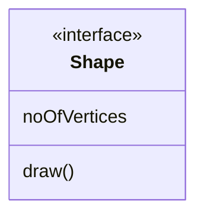

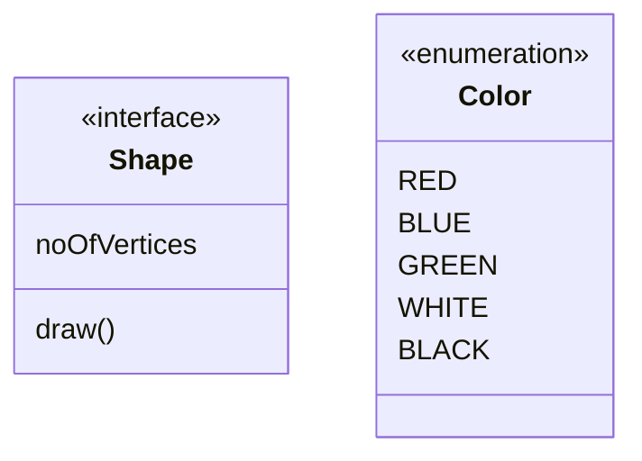

## 成员

可见性描述符：

- `+` Public
- `-` Private
- `#` Protected
- `～` Package/Internal

具有返回值的方法：

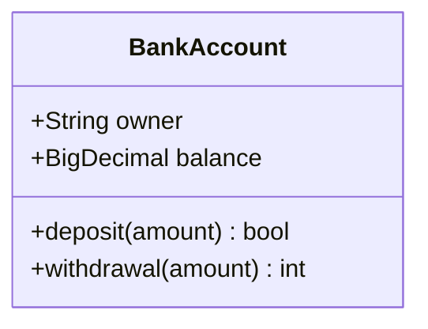
## 关系

### 链接（Link）

对象之间的基本关系

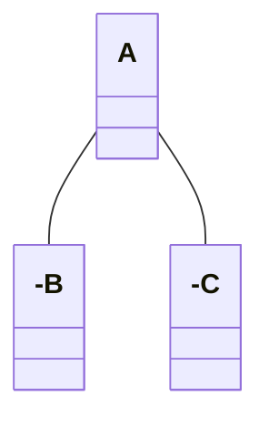

### 泛化（Generalization/Inheritance）

- Represents an "is-a" relationship.  
- An abstract class name is shown in italics.  
- A solid line with a hollow arrowhead that point from the child to the parent class

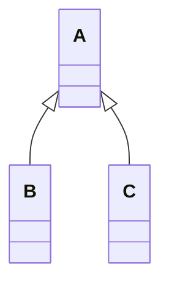

### 组合（Composition）

是一种包含关系（" ... is a part of ..."）。成分类必须依靠合成类而存在。整体与部分是不可分的，整体的生命周期结束也就意味着部分的生命周期结束。合成类别完全拥有成分类别，负责创建、销毁成分类别。例如汽车与化油器，又例如公司与公司部门就是一种组成关系。

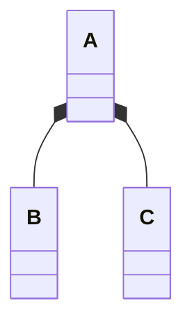

### 聚合（Aggregation）

表示整体与部分的一类特殊的关联关系，是“弱”的包含（" ... owns a ..." ）关系，成分类可以不依靠聚合类而单独存在，可以具有各自的生命周期，部分可以属于多个整体对象，也可以为多个整体对象共享（sharable）。例如，池塘与（池塘中的）鸭子。再例如教授与课程就是一种聚合关系。又例如图书馆包含(owns a) 学生和书籍。即使没有图书馆，学生亦可以存在，学生和图书馆之间的关系是聚集。

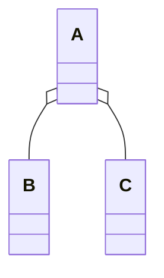

### 关联（Association）

在语义上是两个类之间、或类与接口之间一种强依赖关系，是一种长期的稳定的关系，" ... has a ..." 。关联关系使一个类知道另外一个类的属性和方法；通常含有“知道”、“了解”的含义。某个对象会长期的持有另一个对象的引用，关联的两个对象彼此间没有任何强制性的约束，只要二者同意，可以随时解除关系或是进行关联，它们在生命期问题上没有任何约定。

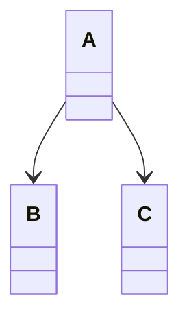

### 依赖（Dependency）

可以简单的理解为一个类 A 使用到了另一个类 B，" ... uses a ..."，被依赖的对象只是作为一种工具在使用，而并不持有对它的引用。而这种使用关系是具有偶然性、临时性的、非常弱的，但是 B 类的变化会影响到 A；表现在代码层面，为类 B 作为参数被类 A 在某个 method（方法）中使用。

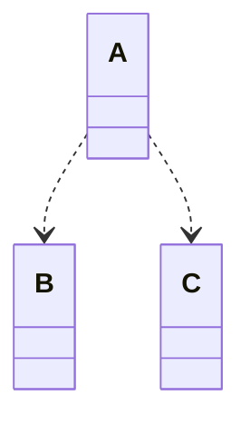

### 实现（Realization）

其中一个模型元素（客户端）实现的行为，其他模型元素（供应商）指定。

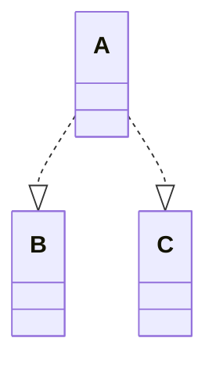

## 关系的基数/多重性

Cardinality / Multiplicity on relations

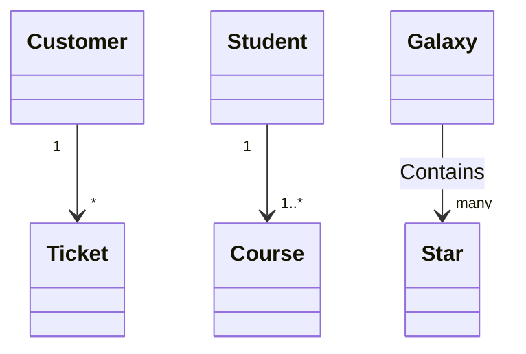

**例子**

![[Pasted image 20240127150212.png]]
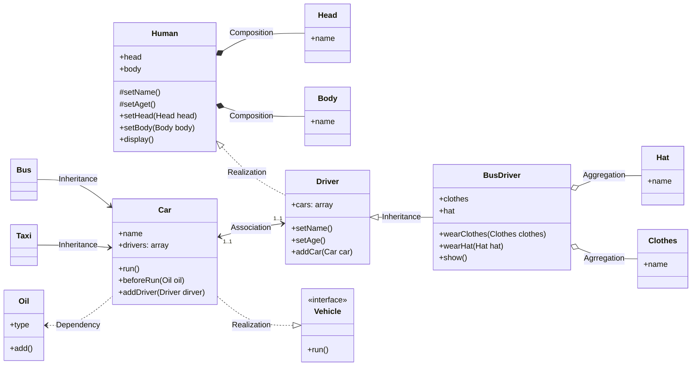

