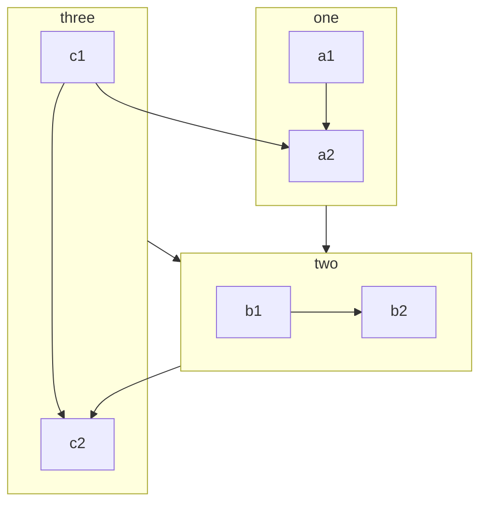

---
tags:
  - tools/editor
  - type/snippet
mastery: 5
---

# Mermaid 图表示例

> Mermaid 是一种基于文本的图表描述语言，可在 Markdown 中直接渲染流程图、类图等。

## 子图（Subgraph）示例

```mermaid
flowchart TB
    c1-->a2
    subgraph one
    a1-->a2
    end
    subgraph two
    b1-->b2
    end
    subgraph three
    c1-->c2
    end
    one --> two
    three --> two
    two --> c2
```
